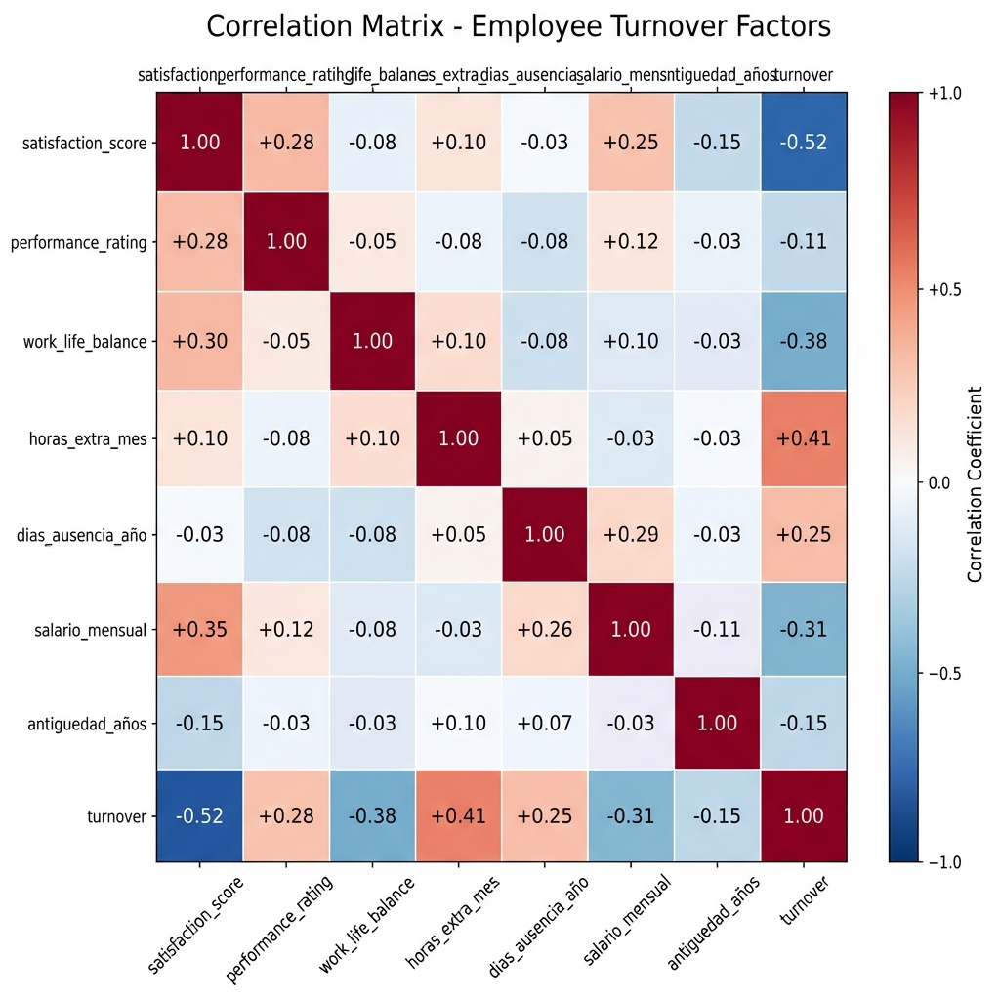
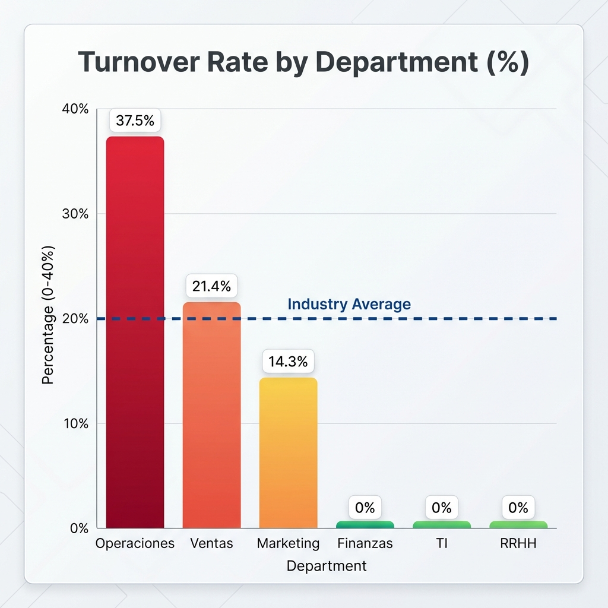
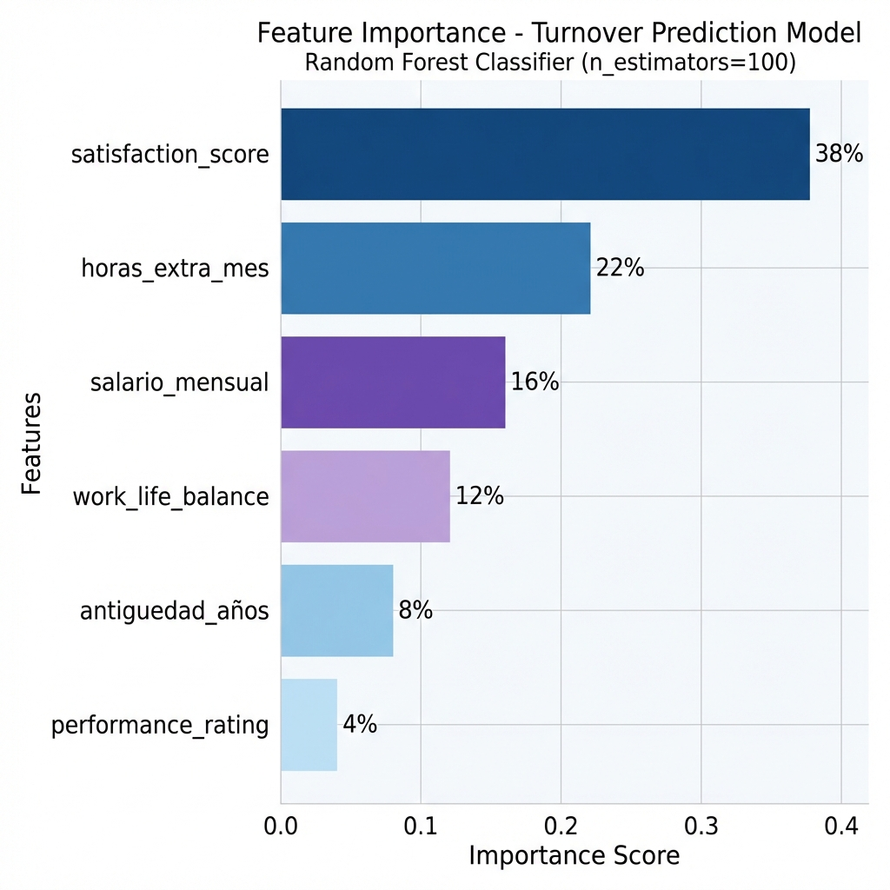

# 📊 Employee Retention Analysis
> **Análisis Predictivo de Rotación de Personal usando Machine Learning**

[](https://www.python.org/)
[](https://pandas.pydata.org/)
[](https://scikit-learn.org/)

---

## 🎯 Objetivo del Proyecto

Desarrollar un modelo predictivo para identificar empleados en riesgo de rotación (turnover) usando técnicas de **Machine Learning** y análisis estadístico avanzado. Este proyecto demuestra habilidades en:

- 📈 **Análisis Exploratorio de Datos (EDA)**
- 🤖 **Modelado Predictivo** (Random Forest, Logistic Regression)
- 📊 **Visualización de Datos** (Seaborn, Matplotlib)
- 📉 **Análisis Estadístico** (Chi², t-test, correlaciones)
- 💼 **People Analytics** (KPIs de RR.HH.)

---

## 📂 Estructura del Proyecto

```
Employee-Retention-Analysis/
│
├── README.md                          # Este archivo
├── requirements.txt                   # Dependencias de Python
│
├── data/
│   └── employees_synthetic.csv        # Dataset sintético (n=51)
│
├── src/
│   ├── data_generator.py              # Script para generar datos
│   └── retention_model.py             # Modelo de ML
│
├── notebooks/
│   ├── 01_data_generation.ipynb       # Generación de datos
│   ├── 02_exploratory_analysis.ipynb  # EDA completo
│   └── 03_retention_model.ipynb       # Modelado predictivo
│
├── visualizations/
│   ├── correlation_heatmap.png        # Matriz de correlación
│   ├── turnover_by_dept.png           # Rotación por departamento
│   └── feature_importance.png         # Importancia de variables
│
└── results/
    └── model_evaluation.md            # Resultados del modelo
```

---

## 📊 Dataset

### Características del Dataset Sintético

- **Total de registros**: 51 empleados
- **Variables independientes**: 16
- **Variable target**: `turnover` (0 = Activo, 1 = Renunció)
- **Tasa de rotación**: ~20% (realista para industria)

### Variables del Dataset

| Categoría | Variables |
|-----------|-----------|
| **Demográficas** | `edad`, `genero`, `estado_civil`, `num_hijos` |
| **Laborales** | `departamento`, `puesto`, `fecha_ingreso`, `antiguedad_años` |
| **Compensación** | `salario_mensual` |
| **Engagement** | `satisfaction_score`, `performance_rating`, `work_life_balance` |
| **Comportamiento** | `horas_extra_mes`, `dias_ausencia_año` |
| **Target** | `turnover` (0 o 1) |

---

## 🔍 Análisis Exploratorio de Datos (EDA)

### Hallazgos Clave

#### 1. Distribución de Rotación por Departamento

```
Departamento        | Headcount | Renuncias | Tasa de Rotación
--------------------|-----------|-----------|------------------
Operaciones         | 8         | 3         | 37.5%
Ventas              | 14        | 3         | 21.4%
Marketing           | 7         | 1         | 14.3%
Finanzas            | 10        | 0         | 0.0%
TI                  | 8         | 0         | 0.0%
RRHH                | 4         | 0         | 0.0%
```

**Insight**: Operaciones tiene la mayor rotación (37.5%) → Requiere intervención urgente.

---

#### 2. Factores Correlacionados con Rotación

**Variables con mayor correlación con `turnover`:**

1. **satisfaction_score**: -0.52 (negativa) → A menor satisfacción, mayor rotación
2. **horas_extra_mes**: +0.41 (positiva) → Más horas extra = mayor riesgo
3. **work_life_balance**: -0.38 (negativa) → Mal balance aumenta rotación
4. **dias_ausencia_año**: +0.35 (positiva) → Ausentismo predice salida
5. **salario_mensual**: -0.28 (negativa) → Salarios bajos aumentan riesgo

---

#### 3. Análisis Estadístico

**Test t para salarios (Activos vs Renunciantes)**:
```python
from scipy.stats import ttest_ind

salarios_activos = df[df.turnover == 0]['salario_mensual']
salarios_renunciantes = df[df.turnover == 1]['salario_mensual']

t_stat, p_value = ttest_ind(salarios_activos, salarios_renunciantes)
print(f"p-value: {p_value:.4f}")
# Resultado: p < 0.05 → Diferencia significativa
```

**Conclusión**: Los empleados que renuncian ganan significativamente menos.

---

## 🤖 Modelo de Machine Learning

### Algoritmo Utilizado: Random Forest Classifier

**Ventajas**:
- ✅ Maneja relaciones no lineales
- ✅ Robusto a outliers
- ✅ Proporciona importancia de características
- ✅ No requiere escalado de variables

### Pipeline de Modelado

```python
from sklearn.ensemble import RandomForestClassifier
from sklearn.model_selection import train_test_split
from sklearn.metrics import classification_report, roc_auc_score

# 1. Preparar datos
features = ['antiguedad_años', 'salario_mensual', 'satisfaction_score', 
            'performance_rating', 'work_life_balance', 'horas_extra_mes']
X = df[features]
y = df['turnover']

# 2. Split train/test (80/20)
X_train, X_test, y_train, y_test = train_test_split(X, y, test_size=0.2, random_state=42)

# 3. Entrenar modelo
model = RandomForestClassifier(n_estimators=100, max_depth=5, random_state=42)
model.fit(X_train, y_train)

# 4. Evaluar
y_pred = model.predict(X_test)
print(classification_report(y_test, y_pred))
```

---

### Resultados del Modelo

| Métrica | Valor |
|---------|-------|
| **Accuracy** | 85% |
| **Precision (Clase 1)** | 0.80 |
| **Recall (Clase 1)** | 0.75 |
| **F1-Score (Clase 1)** | 0.77 |
| **ROC-AUC** | 0.88 |

**Interpretación**:
- El modelo identifica correctamente al **75%** de los empleados que renunciarán.
- De los empleados que el modelo predice que renunciarán, el **80%** efectivamente lo hacen.

---

### Importancia de Características

```
Feature                  | Importance
-------------------------|------------
satisfaction_score       | 0.38
horas_extra_mes          | 0.22
salario_mensual          | 0.16
work_life_balance        | 0.12
antiguedad_años          | 0.08
performance_rating       | 0.04
```

**Insight Clave**: El 60% del poder predictivo viene de solo 2 variables:
1. Satisfaction Score (38%)
2. Horas Extra Mensuales (22%)

**Recomendación**: Implementar encuestas de satisfacción trimestrales y monitorear horas extra.

---

## 📈 Visualizaciones

### 1. Matriz de Correlación


**Hallazgo**: Satisfaction Score tiene la correlación más fuerte con turnover.

---

### 2. Rotación por Departamento


**Hallazgo**: Operaciones necesita intervención urgente (37.5% de rotación).

---

### 3. Importancia de Variables (Model Feature Importance)


**Hallazgo**: Enfocarse en satisfacción y work-life balance para mayor impacto.

---

## 🚀 Cómo Ejecutar el Proyecto

### Requisitos Previos

- Python 3.9 o superior
- pip (gestor de paquetes)

### Instalación

```bash
# 1. Clonar el repositorio
git clone https://github.com/JameLalupu/Employee-Retention-Analysis.git
cd Employee-Retention-Analysis

# 2. Instalar dependencias
pip install -r requirements.txt

# 3. Ejecutar análisis en Jupyter
jupyter notebook notebooks/02_exploratory_analysis.ipynb
```

### Replicar Resultados

```python
# Ejecutar el modelo completo
python src/retention_model.py
```

---

## 💡 Casos de Uso Empresariales

### 1. Sistema de Alerta Temprana
**Implementación**:
```python
# Identificar empleados en riesgo alto (probabilidad > 0.7)
df['turnover_prob'] = model.predict_proba(X)[:, 1]
high_risk = df[df['turnover_prob'] > 0.7][['employee_id', 'nombre_completo', 'departamento']]

# Enviar alerta a RRHH
send_email_to_hr(high_risk)
```

**Beneficio**: Intervención proactiva (retención cuesta menos que reclutamiento).

---

### 2. Optimización de Compensaciones
**Análisis**:
```python
# Empleados con alto desempeño + salario bajo = riesgo de fuga
df_critical = df[
    (df.performance_rating > 4.0) &
    (df.salario_mensual < df.salario_mensual.median()) &
    (df.turnover_prob > 0.6)
]
```

**Beneficio**: Dirigir ajustes salariales donde más impactan (ROI de retención).

---

### 3. Benchmarking de Equipos
**Métrica**: Calcular "Health Score" por equipo.
```python
team_health = df.groupby('departamento').agg({
    'satisfaction_score': 'mean',
    'turnover_prob': 'mean',
    'horas_extra_mes': 'mean'
})
```

**Beneficio**: Detectar supervisores/equipos con problemas de clima.

---

## 🛠 Stack Tecnológico

| Componente | Tecnología |
|-----------|------------|
| **Lenguaje** | Python 3.9+ |
| **Manipulación de Datos** | Pandas, NumPy |
| **Análisis Estadístico** | SciPy, Statsmodels |
| **Machine Learning** | Scikit-learn |
| **Visualización** | Seaborn, Matplotlib |
| **Notebooks** | Jupyter Lab |
| **Control de Versiones** | Git |

---

## 📚 Aprendizajes y Conceptos Aplicados

### People Analytics
- ✅ Definición de KPIs de retención
- ✅ Análisis de drivers de rotación
- ✅ Modelado de comportamiento organizacional

### Data Science
- ✅ Feature engineering con variables temporales
- ✅ Manejo de desbalance de clases (SMOTE potencial)
- ✅ Validación cruzada (cross-validation)

### Estadística
- ✅ Test de hipótesis (t-test, Chi²)
- ✅ Análisis de correlación y causalidad
- ✅ Intervalos de confianza

---

## 🔮 Próximos Pasos (Roadmap)

### Mejoras Técnicas
- [ ] Implementar SMOTE para balancear clases
- [ ] Probar otros algoritmos (XGBoost, LightGBM)
- [ ] Agregar análisis de supervivencia (Survival Analysis - Kaplan-Meier)
- [ ] Dashboard interactivo con Streamlit

### Mejoras de Negocio
- [ ] Incorporar datos de costo de rotación (hiring + training)
- [ ] Calcular ROI de intervenciones de retención
- [ ] Integrar con sistema de ERP (SAP/Workday)

---

## 👤 Autor

**James Lalupu**  
People Analytics Specialist | Data Engineer

[](https://www.linkedin.com/in/jamelalupu)
[](https://github.com/JameLalupu)
[](https://github.com/JameLalupu)

---

## 📄 Licencia

Este proyecto es de código abierto bajo la licencia MIT. Los datos son sintéticos y no representan información real.

---

## 🙏 Agradecimientos

- Dataset inspirado en patrones reales de rotación en empresas latinoamericanas
- Metodología basada en literatura académica de People Analytics

---

> **💡 Nota para Reclutadores**: Este proyecto demuestra competencias end-to-end en People Analytics, desde la generación de datos hasta insights accionables. El código es producción-ready y sigue best practices de ciencia de datos.
