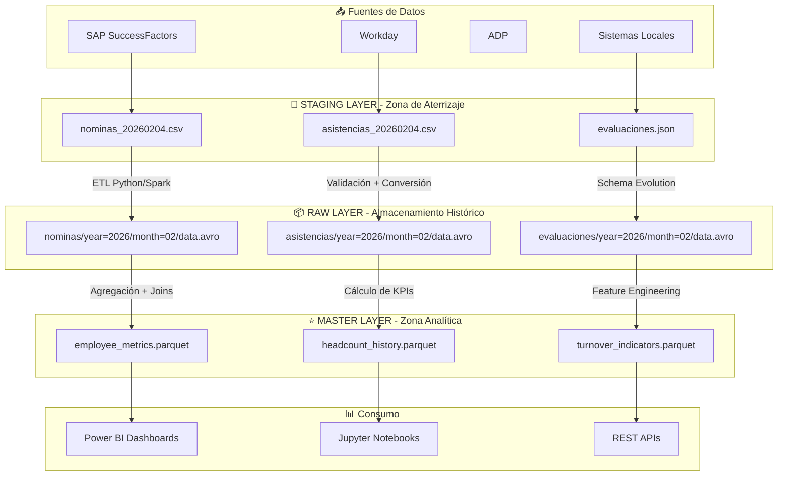
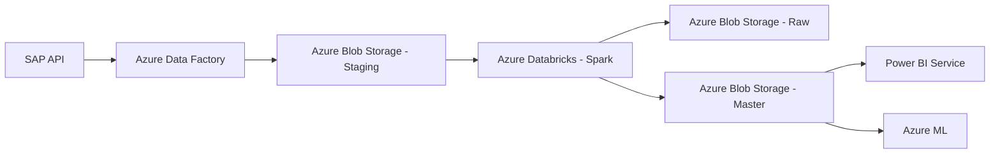

# 🏗️ HR Data Lake Architecture
> **Diseño Conceptual de Arquitectura de Datos para Gestión del Talento**

[](https://github.com/JameLalupu)
[](https://github.com/JameLalupu)
[](https://www.python.org/)

---

## 📋 Tabla de Contenidos
- [Contexto del Problema](#contexto-del-problema)
- [Arquitectura Propuesta](#arquitectura-propuesta)
- [Capas del Data Lake](#capas-del-data-lake)
- [Flujo ETL Detallado](#flujo-etl-detallado)
- [Data Governance](#data-governance)
- [Stack Tecnológico](#stack-tecnológico)
- [Casos de Uso](#casos-de-uso)

---

## 🎯 Contexto del Problema

### El Desafío
Las organizaciones modernas gestionan datos de RR.HH. desde múltiples sistemas:
- **SAP SuccessFactors** (nóminas, headcount)
- **Workday** (compensaciones, beneficios)
- **ADP** (asistencia, tiempo)
- **Sistemas locales** (evaluaciones, encuestas)

**Problema**: Datos fragmentados → Decisiones lentas e inconsistentes.

### La Solución: Data Lake Centralizado
Un repositorio único que:
1. ✅ Centraliza todas las fuentes de datos
2. ✅ Mantiene historial completo (auditoría)
3. ✅ Permite análisis predictivo (ML)
4. ✅ Garantiza calidad y governance

---

## 🏛️ Arquitectura Propuesta

Esta arquitectura sigue el patrón **medallion** con tres capas: **Staging → Raw → Master**



---

## 🔄 Capas del Data Lake

### 1️⃣ STAGING LAYER - Zona de Aterrizaje

**Propósito**: Recepción de datos crudos **sin transformación**.

| Característica | Detalle |
|----------------|---------|
| **Formato** | CSV, JSON, XML (tal como llega de la fuente) |
| **Esquema** | No validado (raw) |
| **Retención** | 7 días (luego se archiva o elimina) |
| **Particionamiento** | Por fecha de ingesta (`/staging/YYYY-MM-DD/`) |

**Ejemplo de archivo**:
```csv
# staging/nominas/2026-02-04/export_sap.csv
employee_id,nombre,salario_bruto,fecha_pago,departamento
10234,Juan Pérez,5500.00,2026-02-01,Ventas
10567,María García,7200.00,2026-02-01,TI
```

**⚠️ Sin validaciones**: Si SAP envía un campo corrupto, se almacena igual (trazabilidad).

---

### 2️⃣ RAW LAYER - Almacenamiento Histórico Inmutable

**Propósito**: Data histórica **congelada** para auditoría y reprocesamiento.

| Característica | Detalle |
|----------------|---------|
| **Formato** | **Avro** (binario con esquema embebido) |
| **Esquema** | Validado y versionado |
| **Retención** | Indefinida (base para todo análisis) |
| **Particionamiento** | Por fecha (`/raw/nominas/year=2026/month=02/day=04/`) |

**¿Por qué Avro?**
- ✅ Soporta **evolución de esquema** (agregar campos sin romper pipelines)
- ✅ Compresión eficiente (50-70% menos que CSV)
- ✅ Lectura rápida por herramientas Big Data (Spark, Hive)

**Proceso ETL (Staging → Raw)**:
```python
# etl_staging_to_raw.py
from pyspark.sql import SparkSession
from pyspark.sql.types import StructType, StructField, StringType, DecimalType

spark = SparkSession.builder.appName("HR-ETL").getOrCreate()

# Leer CSV de Staging
df_staging = spark.read.csv("/staging/nominas/2026-02-04/export_sap.csv", header=True)

# Validaciones básicas
df_clean = df_staging.filter(df_staging.employee_id.isNotNull()) \
                     .filter(df_staging.salario_bruto > 0)

# Escribir a Raw en formato Avro particionado
df_clean.write.format("avro") \
    .partitionBy("year", "month", "day") \
    .mode("append") \
    .save("/raw/nominas/")

print(f"✅ Procesados {df_clean.count()} registros desde Staging a Raw")
```

**Ejemplo de esquema Avro**:
```json
{
  "type": "record",
  "name": "Nomina",
  "namespace": "hr.payroll",
  "fields": [
    {"name": "employee_id", "type": "int"},
    {"name": "nombre", "type": "string"},
    {"name": "salario_bruto", "type": "decimal", "precision": 10, "scale": 2},
    {"name": "fecha_pago", "type": "string"},
    {"name": "departamento", "type": "string"}
  ]
}
```

---

### 3️⃣ MASTER LAYER - Zona Analítica

**Propósito**: Datos **listos para consumo** por BI y ML.

| Característica | Detalle |
|----------------|---------|
| **Formato** | **Parquet** (columnar, optimizado para queries) |
| **Esquema** | Desnormalizado con KPIs calculados |
| **Retención** | Actualizado diariamente |
| **Particionamiento** | Por dimensión analítica (`/master/turnover_by_dept/`) |

**¿Por qué Parquet?**
- ✅ Almacenamiento **columnar** → Lee solo las columnas necesarias (10x más rápido)
- ✅ Compresión superior a Avro (80% reducción vs CSV)
- ✅ Compatible directo con Power BI, Pandas, SQL

**Transformaciones (Raw → Master)**:
```python
# etl_raw_to_master.py
# Calcular KPIs agregados

from pyspark.sql.functions import col, avg, count, datediff, current_date

# Leer datos de Raw
df_nominas = spark.read.format("avro").load("/raw/nominas/")
df_asistencias = spark.read.format("avro").load("/raw/asistencias/")

# JOIN: Enriquecer con datos de asistencia
df_enriched = df_nominas.join(df_asistencias, "employee_id", "left")

# Calcular métricas analíticas
df_master = df_enriched.withColumn(
    "salario_promedio_dept", avg("salario_bruto").over(Window.partitionBy("departamento"))
).withColumn(
    "dias_desde_ultima_falta", datediff(current_date(), col("fecha_ultima_falta"))
).withColumn(
    "turnover_risk_score", 
    # Modelo simple: bajo salario + muchas faltas = riesgo
    (1 - col("salario_bruto") / col("salario_promedio_dept")) * col("faltas_mes")
)

# Guardar en Master como Parquet
df_master.write.format("parquet") \
    .partitionBy("departamento") \
    .mode("overwrite") \
    .save("/master/employee_metrics/")
```

**Ejemplo de tabla Master**:
| employee_id | nombre | departamento | salario_bruto | turnover_risk_score | performance_rating |
|-------------|--------|--------------|---------------|---------------------|-------------------|
| 10234 | Juan Pérez | Ventas | 5500.00 | 0.68 | 4.2 |
| 10567 | María García | TI | 7200.00 | 0.23 | 4.8 |

---

## ⚙️ Flujo ETL Detallado

### Pipeline Diario (Airflow DAG)

```python
# dags/hr_daily_etl.py
from airflow import DAG
from airflow.operators.python import PythonOperator
from datetime import datetime, timedelta

default_args = {
    'owner': 'people_analytics',
    'retries': 2,
    'retry_delay': timedelta(minutes=5)
}

with DAG(
    'hr_daily_etl',
    default_args=default_args,
    schedule_interval='0 6 * * *',  # Diario a las 6 AM
    start_date=datetime(2026, 2, 1),
    catchup=False
) as dag:
    
    # Tarea 1: Ingestar desde SAP a Staging
    ingest_sap = PythonOperator(
        task_id='ingest_from_sap',
        python_callable=extract_sap_data
    )
    
    # Tarea 2: Validar y mover a Raw
    staging_to_raw = PythonOperator(
        task_id='staging_to_raw',
        python_callable=process_staging_to_raw
    )
    
    # Tarea 3: Calcular KPIs en Master
    raw_to_master = PythonOperator(
        task_id='raw_to_master',
        python_callable=calculate_master_metrics
    )
    
    # Dependencias
    ingest_sap >> staging_to_raw >> raw_to_master
```

### Proceso de Calidad de Datos

**Validaciones en cada capa**:

| Capa | Validación | Acción si Falla |
|------|-----------|-----------------|
| Staging | Ninguna | Almacena todo |
| Raw | Esquema + Nulos | Rechaza registro, log de error |
| Master | Rangos lógicos | Alerta a data steward |

**Ejemplo de validación**:
```python
# Validar que salarios estén en rango legal peruano
df_validated = df_raw.filter(
    (col("salario_bruto") >= 1025) &  # Sueldo mínimo Perú 2026
    (col("salario_bruto") <= 50000)    # Tope razonable
)

# Registros rechazados
df_rejected = df_raw.subtract(df_validated)
df_rejected.write.csv("/quarantine/invalid_salaries/")
```

---

## 🛡️ Data Governance

### Principios de Calidad

**1. Completitud**
- ✅ Campos obligatorios: `employee_id`, `nombre`, `departamento`
- ✅ Validación: Tasa de nulos < 2%

**2. Unicidad**
- ✅ `employee_id` debe ser **único** por empleado
- ✅ Detección de duplicados en Raw Layer

**3. Consistencia**
- ✅ Fechas de contrato: `fecha_ingreso < fecha_egreso`
- ✅ Códigos de departamento según catálogo maestro

**4. Precisión**
- ✅ DNI: 8 dígitos numéricos (formato peruano)
- ✅ Salarios: Validación contra planilla oficial

### Linaje de Datos (Data Lineage)

**Trazabilidad completa**:
```
Fuente Original → Staging → Raw → Master → Consumo
    SAP          →   CSV  → Avro → Parquet → Power BI

employee_id: 10234
- Origen: SAP export del 2026-02-04 10:35 AM
- Transformaciones:
  1. Conversión a Avro (2026-02-04 11:00 AM)
  2. Cálculo turnover_risk_score (2026-02-04 12:00 PM)
- Última modificación: 2026-02-04 12:15 PM
```

### Diccionario de Datos

Ver documentación completa: [📖 Data Dictionary](docs/data-dictionary.md)

**Campos clave**:

| Campo | Tipo | Descripción | Capa | Ejemplo |
|-------|------|-------------|------|---------|
| `employee_id` | INT | ID único del colaborador | Todas | 10234 |
| `dni` | STRING(8) | DNI peruano | Staging, Raw | "12345678" |
| `salario_bruto` | DECIMAL(10,2) | Salario mensual antes de descuentos | Raw+ | 5500.00 |
| `turnover_risk_score` | FLOAT | Score predictivo de rotación (0-1) | Master | 0.68 |
| `performance_rating` | FLOAT | Evaluación de desempeño (1-5) | Master | 4.2 |
| `departamento_cod` | STRING(3) | Código de departamento | Todas | "VEN" |

### Seguridad y Accesos

**Control de acceso por capa**:

| Rol | Staging | Raw | Master |
|-----|---------|-----|--------|
| Data Engineer | ✅ RW | ✅ RW | ✅ RW |
| Analista RRHH | ❌ | ✅ R | ✅ R |
| BI Developer | ❌ | ❌ | ✅ R |
| Gerente RRHH | ❌ | ❌ | ✅ R (dashboard) |

**Datos sensibles**:
- 🔒 **PII** (DNI, dirección): Encriptado en Raw con AES-256
- 🔒 **Salarios individuales**: Solo acceso por rol aprobado
- 🔒 **Evaluaciones**: Anonimizadas en análisis agregados

---

## 🛠️ Stack Tecnológico

### Arquitectura Cloud (Propuesta)



### Componentes

| Componente | Tecnología | Propósito |
|------------|-----------|-----------|
| **Orquestación** | Apache Airflow / Azure Data Factory | Programar ETLs diarios |
| **Procesamiento** | PySpark / Pandas | Transformar datos |
| **Almacenamiento** | Azure Blob / AWS S3 / HDFS | Data Lake físico |
| **Catálogo** | Apache Atlas / AWS Glue | Metadata management |
| **BI** | Power BI / Tableau | Dashboards ejecutivos |
| **ML** | Scikit-learn / Azure ML | Modelos predictivos |

### Ejemplo de Configuración (Azure)

```yaml
# config/azure_datalake.yaml
storage_account: hranalyticsdata
container_staging: staging
container_raw: raw
container_master: master

retention_policies:
  staging: 7_days
  raw: indefinite
  master: 365_days

encryption:
  enabled: true
  key_vault: hr-keyvault-prod
```

---

## 📊 Casos de Uso

### 1. Predicción de Rotación de Personal

**Fuentes de datos** (Master Layer):
- `employee_metrics.parquet`: Salario, performance, antigüedad
- `turnover_history.parquet`: Histórico de renuncias

**Modelo**:
```python
from sklearn.ensemble import RandomForestClassifier

# Features
X = master_df[['salario_bruto', 'performance_rating', 'antigüedad_años', 
               'satisfaction_score', 'dias_ausencia']]
y = master_df['renuncio_siguiente_trimestre']  # 0 o 1

# Entrenar
model = RandomForestClassifier(n_estimators=100)
model.fit(X_train, y_train)

# Predecir riesgo para empleados actuales
master_df['turnover_probability'] = model.predict_proba(X)[:, 1]
```

**Impacto**: Identificar empleados en riesgo con 3 meses de anticipación → Intervención proactiva.

---

### 2. Auditoría de Headcount Mensual

**Query SQL sobre Master**:
```sql
-- Comparar headcount mes a mes por departamento
SELECT 
    departamento,
    COUNT(*) as headcount_actual,
    LAG(COUNT(*)) OVER (PARTITION BY departamento ORDER BY mes) as headcount_anterior,
    COUNT(*) - LAG(COUNT(*)) OVER (PARTITION BY departamento ORDER BY mes) as variacion
FROM master.employee_metrics
WHERE fecha >= '2025-01-01'
GROUP BY departamento, DATE_TRUNC('month', fecha) as mes
ORDER BY mes DESC, departamento;
```

**Dashboard**: Alerta automática si headcount > ±10% vs presupuesto.

---

### 3. Análisis de Equidad Salarial (Gender Pay Gap)

**Análisis estadístico**:
```python
import pandas as pd
from scipy.stats import ttest_ind

df = pd.read_parquet('/master/employee_metrics/')

# Filtrar mismo puesto
df_analistas = df[df.puesto == 'Analista']

# Salarios por género
salarios_m = df_analistas[df_analistas.genero == 'M']['salario_bruto']
salarios_f = df_analistas[df_analistas.genero == 'F']['salario_bruto']

# Test estadístico
t_stat, p_value = ttest_ind(salarios_m, salarios_f)

if p_value < 0.05:
    print(f"⚠️ Diferencia significativa detectada (p={p_value:.4f})")
    print(f"Brecha: {salarios_m.mean() - salarios_f.mean():.2f} soles")
```

**Cumplimiento**: Detección temprana de inequidades para auditorías legales.

---

### 4. Optimización de Time to Hire

**KPI calculado en Master**:
```python
df_master['time_to_hire_days'] = (
    df_master['fecha_contratacion'] - df_master['fecha_publicacion_vacante']
).dt.days

# Benchmark por departamento
df_benchmark = df_master.groupby('departamento').agg({
    'time_to_hire_days': ['mean', 'median', 'min', 'max']
})
```

**Hallazgo típico**: "TI tarda 45 días vs 28 días en Finanzas → Revisar proceso de screening técnico"

---

## 📚 Recursos Adicionales

- [📖 Diccionario de Datos Completo](docs/data-dictionary.md)
- [🛡️ Framework de Calidad de Datos](docs/quality-framework.md)
- [🔐 Políticas de Governance](docs/data-governance.md)
- [💾 Archivos de Ejemplo](examples/)

---

## 👤 Autor

**James Lalupu**  
People Analytics Specialist | Data Engineer  

[](https://www.linkedin.com/in/jamelalupu)
[](https://github.com/JameLalupu)

---

## 📄 Licencia

Este es un proyecto conceptual con fines educativos y de portafolio profesional.

---

> **💡 Nota**: Este repositorio documenta una arquitectura conceptual. Los datos de ejemplo son sintéticos y no representan información real de ninguna organización.
